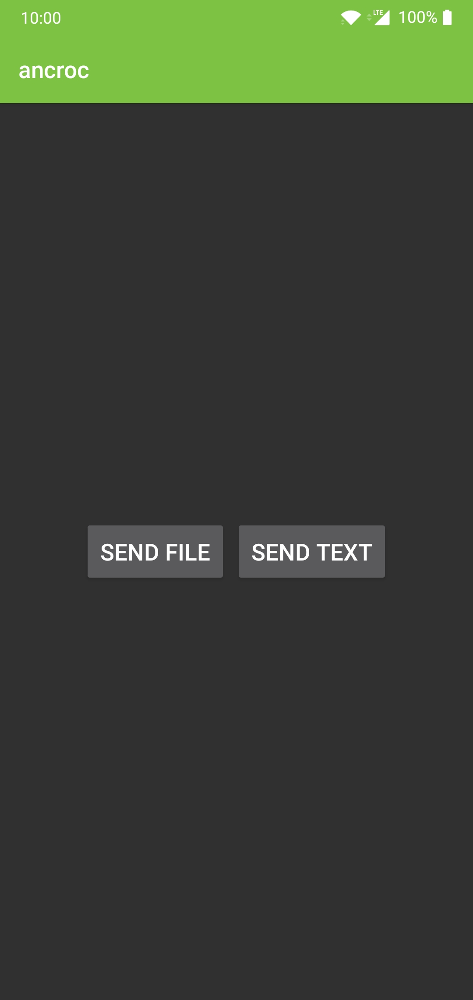
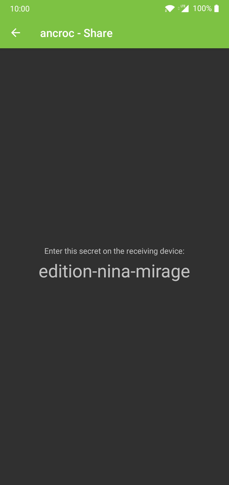

# Ancroc

Croc for Android.

| Start screen                             | Ancroc in action                         |
|------------------------------------------|------------------------------------------|
|  |  | 

## About

Ancroc is an Android GUI for [croc](https://github.com/schollz/croc), a tool that allows any two
devices to simply and securely transfer files.

Ancroc uses the croc program, compiled to an aar library via [gomobile](https://godoc.org/golang.org/x/mobile/cmd/gomobile).

## Build

Just build via Android Studio.

If you want to compile the croc binary, head over to [hsjoberg/croc](https://github.com/hsjoberg/croc).

## Current Status

Ancroc can currently send text and files. It cannot send multiple files at once.

Ancroc cannot receive text or files right now.

## License

MIT